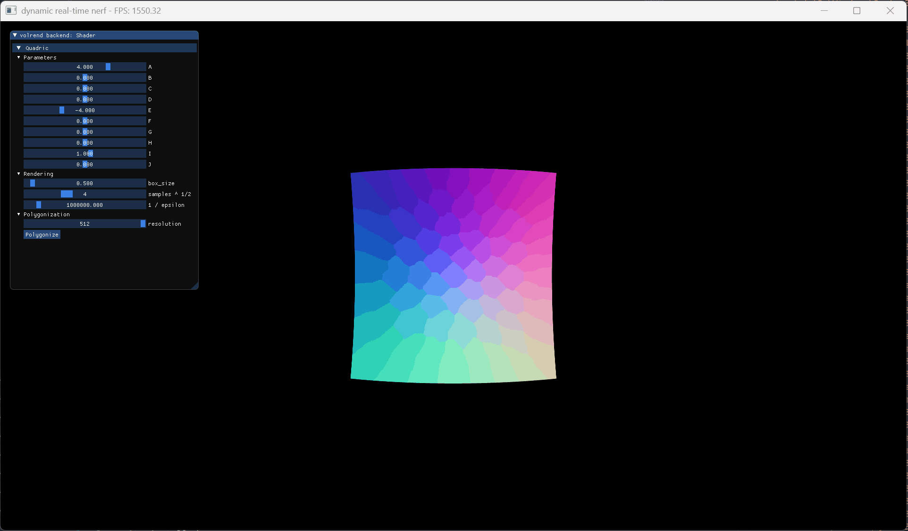

# Quadratic Surface Visualization Using Ray-casting and Polygonization



The ray-casting shown in the demo might look like mesh flat shading. This is because the gif compression algorithm reduces the number of colors available greatly, make the actual smooth shading results look coarse. Please compile and run the code to see the actual results.

## Inspiration

### Main Algorithms

For polygonization, we'd like to use [Marching Cubes](https://dl.acm.org/doi/abs/10.1145/37402.37422).

For ray-casting, we'd like to use [GPU-Based Ray-Casting of Quadratic Surfaces](https://reality.cs.ucl.ac.uk/projects/quadrics/pbg06.html).

### Some Reference for the Project

This code base is heavily modified from my undergraduate thesis project: https://github.com/dendenxu/volrend_private, which is in turn a heavily modified version of Alex Yu's https://github.com/sxyu/volrend.

By "heavily modify", we mean we removed unused CUDA code and related C++ sources and added ray-casting + polygonization + mesh rendering related code.

For polygonization (Marching Cubes), we borrowed from https://github.com/pmneila/PyMCubes.

For ray casting, we borrowed from the shader implementation in https://www.shadertoy.com/view/fl3SDN.

We used https://github.com/nmwsharp/happly for PLY mesh saving.

We used https://github.com/ocornut/imgui for GUI control elements.

We used https://github.com/Tom94/tinylogger for logging.

OpenGL related stuff is pretty standard. https://github.com/nigels-com/glew for OpenGL runtime loading. https://github.com/glfw/glfw for window management. https://github.com/g-truc/glm for `glsl` like vector and matrix math implementation.

## Usage

### Building and Running

This project is written in C++ along with `glsl` shaders.

1. Clone the project (or just use existing source)
    ```shell
    git clone https://github.com/dendenxu/quadratic_surface --recursive
    ```
    If you've already got the packaged source files, this step can be omitted.
2. Run `cmake` to configure and build the project.

    ```shell
    # Windows
    mkdir build
    cd build
    cmake ..
    cmake --build . --config Realease -j
    
    # Linux
    mkdir build
    cd build
    cmake ..
    make -j
    ```

    During `cmake ..`, you might see prompts about missing system packages, install them to build the program properly.
3. Run the built program by
   ```shell
   # Windows
   ./Release/volrend.exe
   
   # Linux
   ./volrend
   ```

We've tested that the build process works OK on a Windows 11 machine with Visual Studio 2022 Community installed.

WSL 2 with Ubuntu 20.04 LTS is also tested to work.

### Controls

- Default rendering mode is `ray-casting`
- Left mouse drag for object oriented rotation
- Right mouse drag for first person mouse control
- Middle mouse wheel for zooming in/out (by moving the camera center closer or further to origin)
- Middle mouse drag for panning
- GUI elements (mainly sliders) can be controlled by mouse drags
  - To input a specific value to a slider, `Ctrl` + left click on the slider to convert it to input mode
- The polygonization button will only invoke the Marching Cubes algorithm once, after which the rendering mode will be set to `Polygonization` automatically.
  - Note that a 512 Marching Cubes takes around 1.5s to complete on a Intel i7-12700H
  - Lower resolutions takes cubically less time to complete
  - We did not implement a multi-threaded Marching Cubes
- The ray-casting mode will typically run in 900-1500 FPS on an laptop Nvidia RTX 3070 Ti GPU
  - Default super resolution sample ratio is 4 (16 samples to produce one pixel)
    - Thus a smaller super sampling ratio might lead to quadratically higher FPS before the limit of the machine is reached
- The polygonization mode with the lowest Marching Cubes resolution (8 x 8 x 8) will run at 3000-4000 FPS (tiny mesh -> nearly no load on the GPU), highest (512 x 512 x 512) ~1000 FPS (with millions of faces & vertices)

## Quadrics

Quatrics are defined with variables `A-J`:

In general, quadratic surfaces are defined as the set of roots of a polynomial of degree two:

$$
f(x,y,z) = Ax^2 + 2Bxy + 2Cxz + 2Dx + Ey^2 + 2Fyz + Gy + Hz^2 + 2Iz + J = 0
$$

Using homogeneous coordinates $\mathbf{x}=(x,y,z,1)^T$ the quadratic surface can be compactly written as: $\mathbf{x}^T\mathbf{Q}\mathbf{x}=0$ with $Q$:

$$
\mathbf{Q} =
\begin{bmatrix}
A & B & C & D \\
B & E & F & G \\
C & F & H & I \\
D & G & I & J
\end{bmatrix}
$$

10 variables in total to define one quadrics.

-   We implemented a shader in `shaders/rt.frag` to trace rays and intersect with the defined quadrics.
-   We perform the Marching Cubes algorithm on the implicit surface in `include/volrend/quadric.hpp`.
